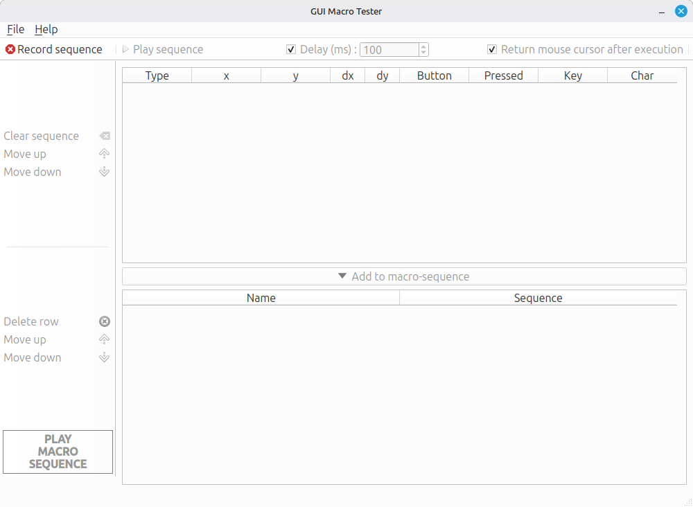

# Introduction
GUI Macro Tester is a visual interface testing tool that allows you to edit, reorder and chain sequences of UI inputs – also known as macros. It can be run fairly easily from the Python source code, though a binary executable for Windows is also available.

The software is released under the Apache License 2.0, which in short means that anyone can use and modify the code, but derivative works have to retain my copyright notice. The GitHub repository is [here](https://github.com/offlinesoftware/guimacrotester).


## Getting started
### Windows executable
Version 1.1.0 is available [here](https://github.com/offlinesoftware/guimacrotester/releases).

### Running from code
#### Required software

- Git 
- Python 3 
- pip (package installer for Python)

#### Procedure
``` bash hl_lines="1" title="1. Clone the repository"
git clone https://github.com/offlinesoftware/guimacrotester.git
```
``` bash hl_lines="1" title="2. Install the dependencies"
pip install pyside6 pynput
```
``` bash hl_lines="1" title="3. Run from the project root"
python src/main.py
```
### Main window
GUI Macro Tester should appear as shown below.
<figure markdown="span">
  { width="800"; style="border:1px solid #000000"}
  <figcaption>GUI Macro Tester running on Linux</figcaption>
</figure>