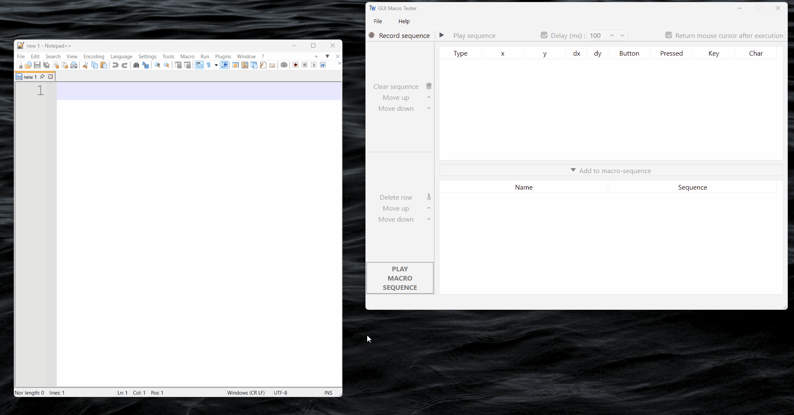

# Recording a sequence
To record a sequence of mouse clicks and keyboard presses:

1. Click the **Record sequence** button
2. Perform the sequence of inputs
3. Click the **Stop recording** button

<figure markdown="span">
  
  <figcaption>Recording a sequence</figcaption>
</figure>